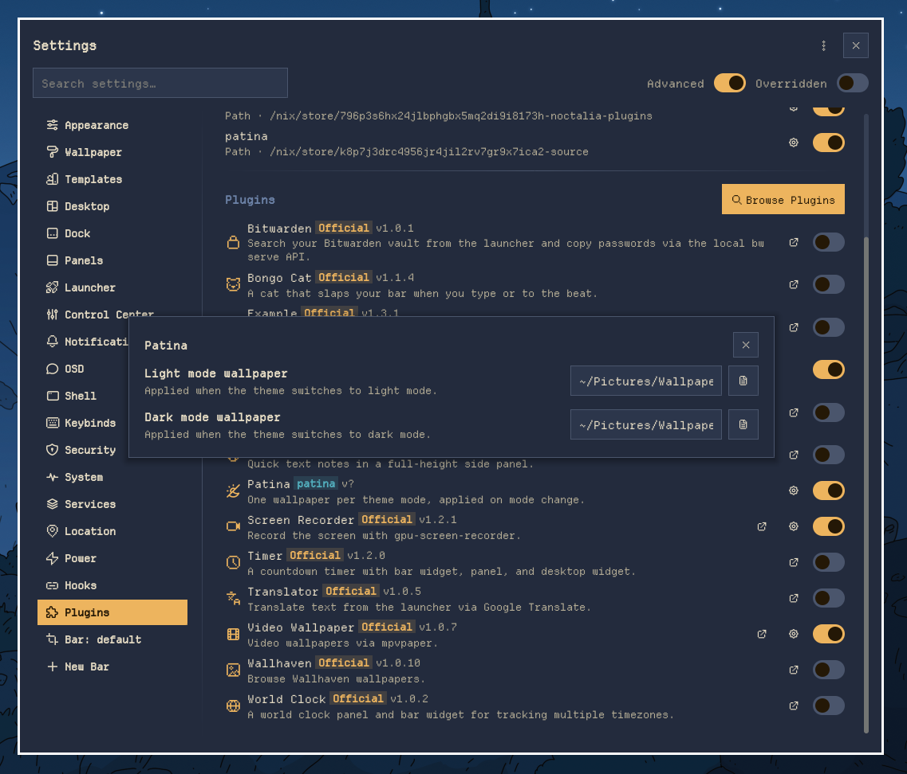

# patina

Noctalia plugin: one wallpaper per theme mode, applied on mode change.

## Installation

    noctalia msg plugins source add patina git https://github.com/tanrendev/patina

## Usage

Enable `tanren/patina`, then pick a light and a dark wallpaper in the plugin settings.

